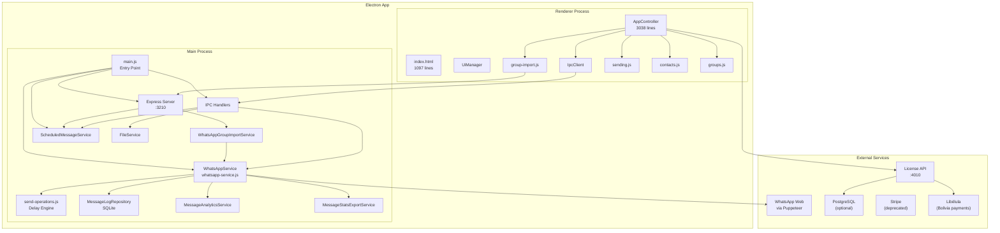
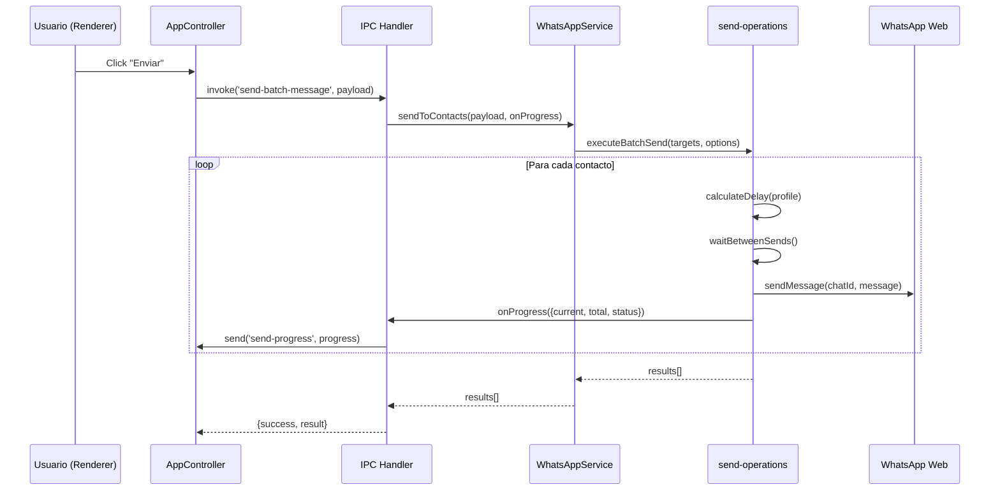
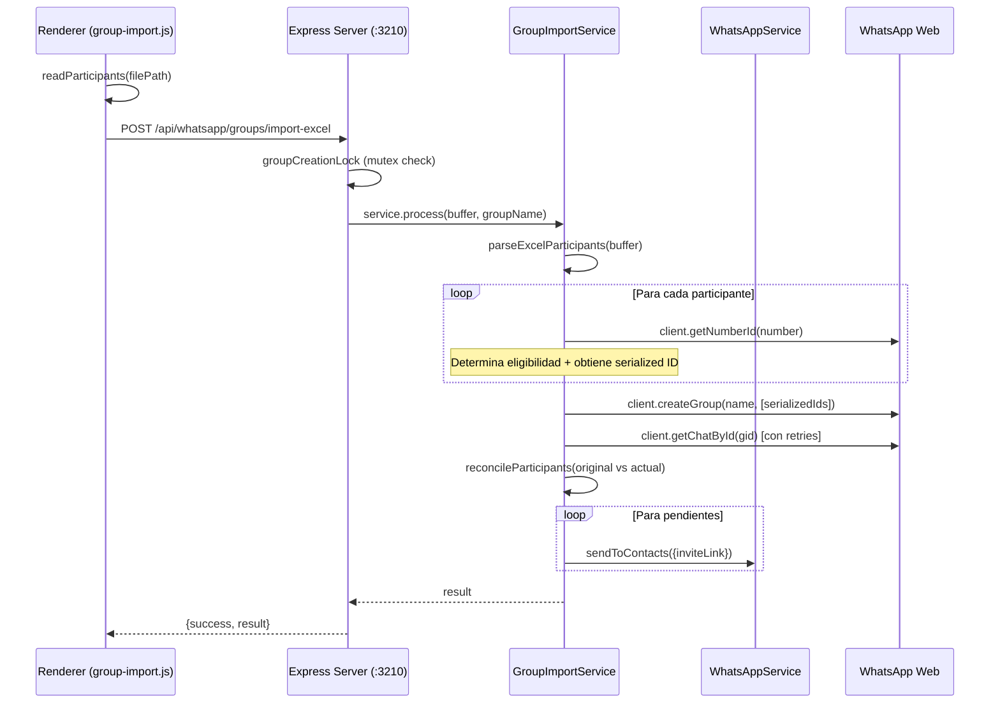
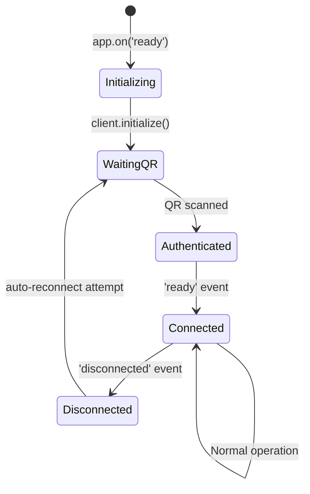
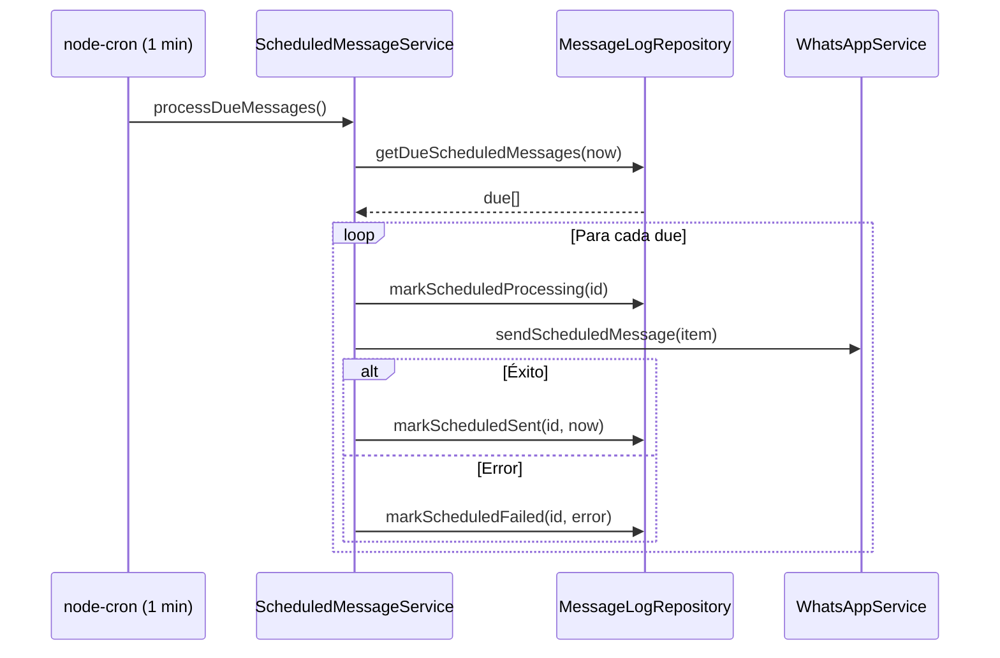
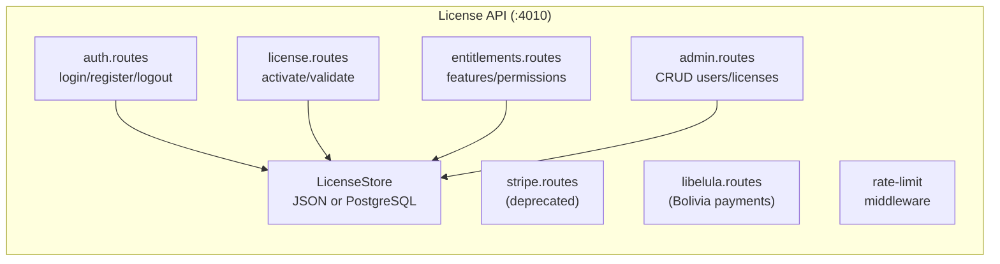

# INFORME MAESTRO DE INGENIERÍA — WhatsApp Sender Electron

> **Proyecto:** WhatsApp Sender Pro (La Martina)
> **Versión analizada:** 3.0.0
> **Fecha de auditoría:** 2026-08-28
> **Método:** Análisis estático completo del código fuente — sin ejecución, sin modificaciones.

---

## Índice

| # | Sección | Estado |
|---|---------|--------|
| 1 | [Resumen ejecutivo](#1-resumen-ejecutivo) | ✅ |
| 2 | [Mapa de arquitectura global](#2-mapa-de-arquitectura-global) | ✅ |
| 3 | [Inventario completo de archivos](#3-inventario-completo-de-archivos) | ✅ |
| 4 | [Descripción de cada módulo/servicio](#4-descripción-de-cada-móduloservicio) | ✅ |
| 5 | [Flujos de datos principales](#5-flujos-de-datos-principales) | ✅ |
| 6 | [Dependencias externas](#6-dependencias-externas) | ✅ |
| 7 | [Áreas de riesgo técnico](#7-áreas-de-riesgo-técnico) | ✅ |
| 8 | [Deuda técnica catalogada](#8-deuda-técnica-catalogada) | ✅ |
| 9 | [Modelo de datos (SQLite)](#9-modelo-de-datos-sqlite) | ✅ |
| 10 | [WhatsApp Service — análisis profundo](#10-whatsapp-service--análisis-profundo) | ✅ |
| 11 | [Sistema de envíos (send-operations)](#11-sistema-de-envíos-send-operations) | ✅ |
| 12 | [Compliance Profiles y delays](#12-compliance-profiles-y-delays) | ✅ |
| 13 | [Creación de grupo desde Excel](#13-creación-de-grupo-desde-excel) | ✅ |
| 14 | [Identidad de participantes (@lid vs @c.us)](#14-identidad-de-participantes-lid-vs-cus) | ✅ |
| 15 | [Reconciliación de participantes](#15-reconciliación-de-participantes) | ✅ |
| 16 | [Sistema de invitaciones privadas](#16-sistema-de-invitaciones-privadas) | ✅ |
| 17 | [Concurrencia (mutex)](#17-concurrencia-mutex) | ✅ |
| 18 | [Sistema de mensajes programados](#18-sistema-de-mensajes-programados) | ✅ |
| 19 | [Analytics y estadísticas](#19-analytics-y-estadísticas) | ✅ |
| 20 | [Exportación de reportes](#20-exportación-de-reportes) | ✅ |
| 21 | [Renderer (UI) — arquitectura](#21-renderer-ui--arquitectura) | ✅ |
| 22 | [Sistema de tabs y modos](#22-sistema-de-tabs-y-modos) | ✅ |
| 23 | [IPC Handlers](#23-ipc-handlers) | ✅ |
| 24 | [Express Server interno](#24-express-server-interno) | ✅ |
| 25 | [Parser de Excel](#25-parser-de-excel) | ✅ |
| 26 | [File Service](#26-file-service) | ✅ |
| 27 | [Licenciamiento (API)](#27-licenciamiento-api) | ✅ |
| 28 | [Almacenamiento y persistencia](#28-almacenamiento-y-persistencia) | ✅ |
| 29 | [Seguridad](#29-seguridad) | ✅ |
| 30 | [Tests existentes](#30-tests-existentes) | ✅ |
| 31 | [Variables de template (mensaje)](#31-variables-de-template-mensaje) | ✅ |
| 32 | [Risk panel y safe presets](#32-risk-panel-y-safe-presets) | ✅ |
| 33 | [Chat history preview](#33-chat-history-preview) | ✅ |
| 34 | [Admin console](#34-admin-console) | ✅ |
| 35 | [Startup y lifecycle](#35-startup-y-lifecycle) | ✅ |
| 36 | [Duplicaciones de código](#36-duplicaciones-de-código) | ✅ |
| 37 | [Preguntas abiertas](#37-preguntas-abiertas) | ✅ |
| 38 | [Roadmap de evolución propuesto](#38-roadmap-de-evolución-propuesto) | ✅ |
| 39 | [Lista de archivos críticos](#39-lista-de-archivos-críticos) | ✅ |

---

## 1. Resumen ejecutivo

**WhatsApp Sender Pro** es una aplicación de escritorio Electron que automatiza el envío de mensajes (texto + archivos) a contactos y grupos de WhatsApp mediante la librería `whatsapp-web.js`. Incluye un sistema de licenciamiento (API separada) y una funcionalidad de "Crear grupo desde Excel".

### Fortalezas principales
- Arquitectura modular con separación clara entre Main Process, Renderer y API
- Sistema de compliance/delays sofisticado con tres perfiles de madurez
- Reconciliación de participantes en grupo con soporte para @lid
- Suite de tests enfocada en el subsistema de creación de grupos (600 líneas, 18+ tests)
- Sistema de mutex para prevenir creación concurrente de grupos
- Persistencia en SQLite con índices adecuados
- Panel de riesgo en tiempo real con bloqueo preventivo

### Debilidades principales
- **3,038 líneas** en un solo archivo (`app-controller.js`) — God Object
- Duplicación de lógica de normalización de teléfonos en 3 archivos
- Dependencia directa del Renderer en `fs`, `path` y `XLSX` (via `nodeIntegration: true`)
- Sin tests para envío de mensajes, analytics, ni la API de licencias
- Sin CI/CD, linting ni type checking configurado
- Secretos hardcodeados en config.js (`dev-secret-change-me`, credenciales admin)
- La API de licencias corre local (localhost:4010) — sin HTTPS en producción

---

## 2. Mapa de arquitectura global



### Modelo de comunicación

| Dirección | Canal | Protocolo |
|-----------|-------|-----------|
| Renderer → Main | `ipcRenderer.invoke()` | Electron IPC |
| Main → Renderer | `webContents.send()` | Electron IPC |
| Renderer → Express (Group Import) | `fetch()` a `127.0.0.1:3210` | HTTP REST |
| Renderer → License API | `fetch()` a `localhost:4010` | HTTP REST |
| Main → WhatsApp | `whatsapp-web.js` + Puppeteer | WebSocket/Chrome DevTools |

---

## 3. Inventario completo de archivos

### Estructura principal

```
whatsapp-sender-electron/
├── src/
│   ├── main/                           # Electron Main Process
│   │   ├── main.js                     # Entry point (297 lines)
│   │   ├── ipc/
│   │   │   └── handlers.js             # IPC handlers (336 lines)
│   │   ├── http/
│   │   │   ├── express-server.js        # Express setup (70 lines)
│   │   │   └── whatsapp-group-import.routes.js  # Group routes (64 lines)
│   │   ├── services/
│   │   │   ├── whatsapp-service.js      # WhatsApp brain (~800+ lines)
│   │   │   ├── whatsapp-group-import-service.js  # Group creation (~500+ lines)
│   │   │   ├── message-log-repository.js         # SQLite DAL (682 lines)
│   │   │   ├── message-analytics-service.js      # Analytics (302 lines)
│   │   │   ├── message-stats-export-service.js   # Excel export (329 lines)
│   │   │   ├── scheduled-message-service.js      # Scheduling (144 lines)
│   │   │   └── file-service.js                   # File ops (210 lines)
│   │   ├── services/whatsapp/
│   │   │   └── send-operations.js       # Delay engine (~500+ lines)
│   │   └── utils/
│   │       └── excel-group-parser.js    # Excel parsing (114 lines)
│   ├── renderer/                        # Renderer Process
│   │   ├── index.html                   # UI (1097 lines)
│   │   ├── styles.css                   # Styles
│   │   └── js/
│   │       ├── renderer.js              # Entry (9 lines)
│   │       └── modules/
│   │           ├── app-controller.js    # GOD OBJECT (3038 lines)
│   │           ├── ui-manager.js        # DOM manipulation
│   │           ├── ipc-client.js        # IPC wrapper (18 lines)
│   │           ├── form-storage.js      # localStorage
│   │           └── app/
│   │               ├── mode-config.js   # UI element IDs (57 lines)
│   │               ├── contacts.js      # Contact logic (250 lines)
│   │               ├── groups.js        # Group logic (102 lines)
│   │               ├── group-import.js  # Group import UI (258 lines)
│   │               └── sending.js       # Send logic (692 lines)
│   └── whatsapp-server.js              # Re-export proxy (1 line)
├── apps/
│   └── api/                             # License API (separate)
│       ├── src/
│       │   ├── app.js                   # Express app (61 lines)
│       │   ├── config.js               # Configuration (34 lines)
│       │   ├── server.js               # Server start
│       │   ├── middleware/
│       │   │   └── rate-limit.js
│       │   ├── routes/
│       │   │   ├── auth.routes.js
│       │   │   ├── license.routes.js
│       │   │   ├── entitlements.routes.js
│       │   │   ├── stripe.routes.js
│       │   │   ├── libelula.routes.js
│       │   │   └── admin.routes.js
│       │   └── services/
│       │       ├── license-store.js     # JSON-based store
│       │       └── postgres-license-store.js
│       ├── scripts/
│       │   ├── init-postgres.js
│       │   ├── sync-app-state-to-relational.js
│       │   └── seed-users.js
│       └── package.json
├── tests/
│   └── group-import-safety.test.js      # Safety tests (600 lines)
├── iniciar_sistema.bat                  # Startup script
├── package.json                         # Root deps
└── docs/                                # Documentation
```

---

## 4. Descripción de cada módulo/servicio

### 4.1 `main.js` — Entry Point
- **Función:** Inicializa la app Electron, crea `BrowserWindow`, instancia servicios globales
- **Responsabilidades:** App lifecycle, window creation, service wiring, Express server start
- **Configuración Puppeteer:** `--no-sandbox`, `--disable-setuid-sandbox`, `--disable-gpu`, headless Chromium
- **Puerto Express:** `3210` (hardcoded)
- **nodeIntegration:** `true` ⚠️

### 4.2 `WhatsAppService` — El Cerebro
- **Función:** Gestiona el cliente `whatsapp-web.js`, contactos, grupos, envíos
- **Patrón:** Singleton (instanciado una vez en `main.js`)
- **Eventos manejados:** `qr`, `ready`, `authenticated`, `auth_failure`, `disconnected`, `message`
- **safeEvaluate:** Wrapper para evaluación segura de código en el contexto de Puppeteer/WhatsApp Web
- **Estado:** Mantiene `groups[]`, `contacts[]`, estado de conexión

### 4.3 `send-operations.js` — Motor de Delays
- **Función:** Ejecuta envíos con delays humanizados y cooldowns periódicos
- **COMPLIANCE_PROFILES:** `new`, `medium`, `mature` (tres perfiles de madurez de cuenta)
- **Funciones clave:** `calculateDelay()`, `waitBetweenSends()`, `waitComplianceCooldown()`
- **Soporte:** Texto, archivos (imágenes, documentos, videos), message splitting, variables de template

### 4.4 `WhatsAppGroupImportService` — Creación de Grupo
- **Función:** Workflow completo: Excel → Validación → Elegibilidad → createGroup → Reconciliación → Invitaciones
- **Patrón:** Servicio stateless, instanciado por request (en el router)
- **Algoritmo de reconciliación:** Compara `serialized` IDs de participantes del grupo real vs. los originales del Excel
- **Fallback:** Si el chat no se materializa post-creación, retries con `getChatById` (hasta 3 intentos)

### 4.5 `MessageLogRepository` — DAL SQLite
- **Función:** Persistencia de logs de mensajes y mensajes programados
- **Tablas:** `message_logs`, `scheduled_messages`
- **Índices:** timestamp, destination_type, destination_id, status
- **Consultas:** Agregaciones diarias/semanales/mensuales, rankings, distribución por tipo

### 4.6 `MessageAnalyticsService` — Analytics
- **Función:** Dashboard de estadísticas, cálculo de unidades, filtros por rango
- **Presets:** `today`, `last-7`, `last-30`, `custom`
- **Unidades:** 1 por texto + 1 por cada archivo adjunto

### 4.7 `ScheduledMessageService` — Programación
- **Función:** CRON cada 1 minuto para procesar mensajes pendientes
- **Dependencia:** `node-cron` con timezone `America/La_Paz`
- **Estado machine:** `pending` → `processing` → `sent` | `failed`
- **Concurrencia:** Flag `this.processing` previene ejecuciones paralelas

### 4.8 `FileService` — Operaciones de Archivo
- **Función:** Diálogos de selección/guardado, exportación CSV/XLSX, importación Excel
- **Soporte:** Imágenes, documentos, videos; Excel con detección inteligente de columnas
- **Variables de contexto:** Genera `context{}` con todas las columnas del Excel normalizadas

### 4.9 `AppController` — God Object del Renderer
- **Función:** TODA la lógica del frontend en un solo archivo
- **Líneas:** 3,038
- **Responsabilidades:** Licenciamiento, UI binding, envíos, estadísticas, admin, scheduling, chat history, form persistence

---

## 5. Flujos de datos principales

### 5.1 Flujo: Envío de mensajes a contactos



### 5.2 Flujo: Creación de grupo desde Excel



---

## 6. Dependencias externas

### 6.1 Dependencias del proyecto principal (`package.json`)

| Paquete | Versión | Función | Riesgo |
|---------|---------|---------|--------|
| `whatsapp-web.js` | 1.34.7 | Core WhatsApp | 🔴 Alto — librería no oficial, puede romperse |
| `electron` | ^34.2.0 | Framework desktop | 🟡 Medio — versión mayor |
| `puppeteer-core` | * | Chromium automation | 🟡 Medio — acoplado a whatsapp-web.js |
| `sqlite3` | ^5.1.7 | Base de datos local | 🟢 Bajo |
| `express` | ^4.21.2 | HTTP server interno | 🟢 Bajo |
| `xlsx` | ^0.18.5 | Parser Excel | 🟢 Bajo |
| `multer` | ^1.4.5 | Upload middleware | 🟢 Bajo |
| `node-cron` | ^3.0.3 | Scheduler | 🟢 Bajo |
| `qrcode` | ^1.5.3 | QR rendering | 🟢 Bajo |
| `exceljs` | * | Excel export avanzado | 🟢 Bajo |
| `chartjs-node-canvas` | * | Gráficos en exports | 🟡 Medio — binding nativo |

### 6.2 Dependencias del API de licencias (`apps/api/package.json`)

| Paquete | Versión | Función |
|---------|---------|---------|
| `express` | ^4.21.2 | HTTP server |
| `bcryptjs` | ^2.4.3 | Password hashing |
| `jsonwebtoken` | ^9.0.2 | JWT auth |
| `pg` | ^8.16.3 | PostgreSQL client |
| `stripe` | ^21.0.1 | Pagos (en desuso) |
| `express-rate-limit` | ^8.3.2 | Rate limiting |
| `uuid` | ^11.0.3 | ID generation |
| `dotenv` | ^16.4.5 | Environment vars |
| `cors` | ^2.8.5 | CORS middleware |

---

## 7. Áreas de riesgo técnico

### 🔴 Riesgo CRÍTICO

| ID | Riesgo | Archivo(s) | Impacto |
|----|--------|------------|---------|
| R1 | `whatsapp-web.js` puede dejar de funcionar sin previo aviso | `whatsapp-service.js` | App completa inutilizable |
| R2 | `nodeIntegration: true` en BrowserWindow | `main.js` | XSS puede ejecutar código arbitrario del sistema |
| R3 | JWT secret hardcodeado (`dev-secret-change-me`) | `apps/api/src/config.js` | Tokens forjables en producción |
| R4 | Credenciales admin hardcodeadas | `apps/api/src/config.js` | Acceso no autorizado |
| R5 | God Object (`app-controller.js`, 3038 líneas) | `app-controller.js` | Inmantenible, alto acoplamiento |

### 🟡 Riesgo MEDIO

| ID | Riesgo | Archivo(s) | Impacto |
|----|--------|------------|---------|
| R6 | Sin HTTPS para la API de licencias | `app-controller.js`, `config.js` | Tokens interceptables en red local |
| R7 | Renderer accede directo a `fs`, `path`, `XLSX` | `group-import.js` | Violación del modelo de seguridad Electron |
| R8 | Duplicación de lógica de normalización | 3 archivos | Divergencia silenciosa de comportamiento |
| R9 | Sin test para el motor de envíos | `send-operations.js` | Regresiones no detectadas |
| R10 | `getChatById` puede fallar permanentemente | `whatsapp-group-import-service.js` | Grupo creado pero sin reconciliación |

### 🟢 Riesgo BAJO

| ID | Riesgo | Archivo(s) |
|----|--------|------------|
| R11 | Sin linting/formatting configurado | proyecto completo |
| R12 | CSP permite `connect-src` a localhost sin restricción de ruta | `index.html` |
| R13 | Stripe todavía presente aunque "en desuso" | `apps/api` |

---

## 8. Deuda técnica catalogada

| Prioridad | Deuda | Archivos afectados | Esfuerzo estimado |
|-----------|-------|---------------------|-------------------|
| 🔴 P0 | `app-controller.js` es un God Object de 3038 líneas | `app-controller.js` | 2-3 sprints |
| 🔴 P0 | `nodeIntegration: true` sin `contextBridge` | `main.js` | 1 sprint |
| 🟡 P1 | Normalización de teléfonos duplicada en 3 archivos | `excel-group-parser.js`, `group-import.js`, `contacts.js` | 2-4 horas |
| 🟡 P1 | Sin tests para `send-operations.js` | — | 1-2 sprints |
| 🟡 P1 | Sin tests para la API de licencias | — | 1 sprint |
| 🟡 P2 | Stripe routes activas pero sin uso | `apps/api/src/routes/stripe.routes.js` | 2 horas |
| 🟢 P3 | Sin CI/CD pipeline | — | 1 sprint |
| 🟢 P3 | Sin ESLint/Prettier configurado | — | 2-4 horas |

---

## 9. Modelo de datos (SQLite)

Base de datos: `{userData}/message-logs.sqlite`

### Tabla `message_logs`

| Columna | Tipo | Descripción |
|---------|------|-------------|
| `id` | INTEGER PK AUTO | ID único |
| `timestamp_iso` | TEXT NOT NULL | ISO 8601 timestamp |
| `destination_type` | TEXT NOT NULL | `'contacts'` o `'groups'` |
| `destination_id` | TEXT NOT NULL | Chat ID (ej: `59179903823@c.us`) |
| `units_total` | INTEGER NOT NULL | Unidades enviadas (1 texto + N archivos) |
| `content_type` | TEXT NOT NULL | `'Texto'`, `'Imagen'`, `'Documento'`, etc. |

**Índices:** `idx_message_logs_timestamp`, `idx_message_logs_destination_type`, `idx_message_logs_destination_id`

### Tabla `scheduled_messages`

| Columna | Tipo | Descripción |
|---------|------|-------------|
| `id` | INTEGER PK AUTO | ID único |
| `created_at_iso` | TEXT NOT NULL | Fecha de creación |
| `scheduled_at_iso` | TEXT NOT NULL | Fecha programada para envío |
| `target_type` | TEXT NOT NULL | `'contacts'` o `'groups'` |
| `target_id` | TEXT NOT NULL | ID del destinatario |
| `target_label` | TEXT | Nombre legible |
| `message_text` | TEXT | Mensaje a enviar |
| `files_json` | TEXT NOT NULL | JSON array de rutas de archivos |
| `send_files_first` | INTEGER DEFAULT 1 | ¿Enviar archivos antes del texto? |
| `delay_min` / `delay_max` | INTEGER | Rango de delay en segundos |
| `status` | TEXT DEFAULT 'pending' | `pending`, `processing`, `sent`, `failed`, `canceled` |
| `last_error` | TEXT | Último error (si falló) |
| `sent_at_iso` | TEXT | Timestamp del envío exitoso |

**Índices:** `idx_scheduled_messages_status`, `idx_scheduled_messages_due`

---

## 10. WhatsApp Service — análisis profundo

**Archivo:** [whatsapp-service.js](file:///m:/whatsapp-sender-electron/src/main/services/whatsapp-service.js)

### Inicialización del cliente

```javascript
// Configuración de Puppeteer (args anti-crash)
puppeteer: {
  executablePath: chromePath,
  headless: true,
  args: ['--no-sandbox', '--disable-setuid-sandbox', '--disable-gpu',
         '--disable-dev-shm-usage', '--no-first-run']
}
// Autenticación
authStrategy: new LocalAuth()
```

### Funciones clave

| Función | Descripción |
|---------|-------------|
| `getGroups()` | Obtiene grupos del chat list, filtra por `isGroup` |
| `getContacts()` | Obtiene contactos, filtra por `isMyContact` |
| `getGroupMembers(groupId)` | Obtiene miembros de un grupo específico |
| `sendToContacts(payload, onProgress)` | Delega a `send-operations.js` |
| `sendToGroups(payload, onProgress)` | Delega a `send-operations.js` |
| `sendScheduledMessage(item)` | Envía un mensaje programado |
| `requestCancelSend()` | Solicita cancelación de envío en curso |
| `getClientState()` | Retorna `CONNECTED`, `OPENING`, o estado del cliente |
| `ensureReady()` | Verifica que el cliente esté listo antes de operar |
| `safeEvaluate()` | Wrapper para evaluación segura en Puppeteer |

### Ciclo de vida del cliente



---

## 11. Sistema de envíos (send-operations)

**Archivo:** [send-operations.js](file:///m:/whatsapp-sender-electron/src/main/services/whatsapp/send-operations.js)

### Algoritmo principal

```
1. Recibir lista de targets (contactos o grupos)
2. Para cada target:
   a. Verificar si se solicitó cancelación → abortar
   b. Calcular delay humanizado según COMPLIANCE_PROFILE
   c. Si se alcanza el umbral de cooldown → pausa larga
   d. Enviar mensaje (texto y/o archivos, según orden configurado)
   e. Registrar en MessageAnalyticsService
   f. Reportar progreso al Renderer
3. Retornar resultados agregados
```

### Variables de template soportadas

| Variable | Fuente | Ejemplo |
|----------|--------|---------|
| `{{nombre}}` | Contact.name o Excel | "Wilson" |
| `{{nombre_completo}}` | Contact.name completo | "Wilson Ramos" |
| `{{apellido}}` | Derivado de nombre | "Ramos" |
| `{{numero}}` | Contact.number | "59179903823" |
| `{{etiqueta_aleatoria}}` | Lista custom del usuario | "vip", "promo" |
| `{{custom_var}}` | Variables personalizadas | Cualquier valor |

### Orden de envío configurable
- **sendFilesFirst = true:** Archivos → Texto
- **sendFilesFirst = false:** Texto → Archivos
- **messageSplit = true:** Cada línea del mensaje se envía como mensaje separado

---

## 12. Compliance Profiles y delays

### Perfiles definidos en el Renderer (`sending.js` SAFE_PRESETS)

| Parámetro | `new` | `medium` | `mature` |
|-----------|-------|----------|----------|
| `maxBatch` | 18 | 35 | 60 |
| `delayMin` (s) | 16 | 12 | 10 |
| `delayMax` (s) | 24 | 22 | 20 |
| `unitDelayMin` (s) | 2 | 1 | 1 |
| `unitDelayMax` (s) | 4 | 3 | 2 |
| `cooldownEvery` | 5 | 8 | 12 |
| `cooldownMinSeconds` | 60 | 45 | 30 |
| `cooldownMaxSeconds` | 95 | 75 | 55 |

### Perfiles definidos en el Backend (`send-operations.js` COMPLIANCE_PROFILES)

| Parámetro | `new` | `medium` | `mature` |
|-----------|-------|----------|----------|
| `BASE_DELAY_MIN` (s) | 16 | 12 | 10 |
| `BASE_DELAY_MAX` (s) | 24 | 22 | 20 |
| `COOLDOWN_EVERY` | 5 | 8 | 12 |
| `COOLDOWN_MIN` (s) | 60 | 45 | 30 |
| `COOLDOWN_MAX` (s) | 95 | 75 | 55 |

> [!IMPORTANT]
> Los valores del Renderer y del Backend son consistentes. El Renderer aplica los presets como sugerencia visual; el Backend los usa como enforcement real.

### Fórmula de delay

```javascript
// Pseudocódigo reconstruido
delay = randomBetween(profile.BASE_DELAY_MIN, profile.BASE_DELAY_MAX);
// + jitter para cada unidad (archivo/texto)
unitDelay = randomBetween(profile.UNIT_DELAY_MIN, profile.UNIT_DELAY_MAX);
// + cooldown periódico
if (messagesSent % profile.COOLDOWN_EVERY === 0) {
    cooldown = randomBetween(profile.COOLDOWN_MIN, profile.COOLDOWN_MAX);
}
```

---

## 13. Creación de grupo desde Excel

**Archivo principal:** [whatsapp-group-import-service.js](file:///m:/whatsapp-sender-electron/src/main/services/whatsapp-group-import-service.js)

### Pipeline completo

```
FASE 1: PARSING
  └── parseExcelParticipants(buffer)
      ├── Lectura del buffer con XLSX
      ├── Detección de columna "Numero" (normalizada)
      ├── Normalización de números con códigos de país
      ├── Deduplicación por Set
      └── Retorna {participants[], errors[]}

FASE 2: ELEGIBILIDAD
  └── Para cada participante:
      ├── client.getNumberId(number) → serializedId
      ├── Si null → marcado como ineligible
      ├── Si @lid → conserva el LID real
      └── Filtra solo elegibles para createGroup

FASE 3: CREACIÓN
  └── client.createGroup(groupName, [serializedIds])
      ├── Retorna gid + participants (con statusCode)
      └── createGroup puede confirmar agregados (statusCode: 200)

FASE 4: MATERIALIZACIÓN
  └── client.getChatById(gid._serialized)
      ├── Retry hasta 3 veces con delay
      ├── Si falla → usa confirmación de createGroup como fallback
      └── Si éxito → extrae participants[] reales

FASE 5: RECONCILIACIÓN
  └── Compara originales vs. participantes reales
      ├── Match por serialized ID (incluyendo @lid)
      ├── Match por número extraído del serialized
      ├── Clasifica: added / pending / unknown
      └── Genera reconciliation{} con conteos

FASE 6: INVITACIONES
  └── Para participantes pendientes:
      ├── Obtiene inviteLink via getInviteCode()
      ├── Envía invitación privada via sendToContacts()
      ├── Clasifica: invitation_sent / invitation_failed
      └── Participantes "added" no reciben invitación

FASE 7: RESULTADO
  └── Retorna resultado final con:
      ├── status: completed | partial | created_without_participants |
      │          created_pending_confirmation | validation_error |
      │          reconciliation_error | group_lookup_failed
      ├── participants[] con status individual
      ├── diagnostics{} (para debugging)
      └── reconciliation{} (conteos de reconciliación)
```

### Estados posibles del resultado

| Status | Significado |
|--------|-------------|
| `completed` | Todos los participantes fueron agregados |
| `partial` | Algunos agregados, otros pendientes con invitación |
| `created_without_participants` | Grupo creado pero ningún participante confirmado |
| `created_pending_confirmation` | createGroup confirmó agregados pero el chat no se materializó |
| `validation_error` | Ningún participante elegible — grupo NO creado |
| `reconciliation_error` | Error durante la fase de reconciliación |
| `group_lookup_failed` | createGroup exitoso pero getChatById falló en todos los reintentos |

---

## 14. Identidad de participantes (@lid vs @c.us)

### El problema

WhatsApp Web usa dos formatos de identificador de usuario:

| Formato | Ejemplo | Uso |
|---------|---------|-----|
| `@c.us` | `59179903823@c.us` | Formato clásico basado en número telefónico |
| `@lid` | `242652901564623@lid` | Formato nuevo (Linked ID), opaco, no contiene número |

### Comportamiento observado en el código

1. **`getNumberId(number)`** puede retornar un ID con servidor `@lid` en lugar de `@c.us`
2. **`createGroup()`** acepta ambos formatos como entrada de participantes
3. **Los participantes del grupo** (`chat.participants`) pueden tener IDs `@lid` incluso si se enviaron como `@c.us`

### Lógica de reconciliación actual

```javascript
// Pseudocódigo simplificado de la reconciliación
for (participant of originalParticipants) {
    const serializedId = participant.getNumberId.serialized;
    
    // Intento 1: Match exacto por serialized
    const exactMatch = actualParticipants.find(p => p.id._serialized === serializedId);
    
    // Intento 2: Match por número extraído (si es @c.us)
    if (!exactMatch) {
        const numberOnly = serializedId.replace(/@.*$/, '');
        const numberMatch = actualParticipants.find(p => 
            p.id._serialized.replace(/@.*$/, '') === numberOnly
        );
    }
    
    // Si @lid y presente → "agregado_realmente"
    // Si @lid y ausente → "pendiente" → enviar invitación
}
```

> [!WARNING]
> Un participante con `@lid` que NO aparece en el grupo real no puede ser reconciliado por número. El sistema correctamente los clasifica como "pendientes" y les envía invitación.

---

## 15. Reconciliación de participantes

### Estructura del objeto `reconciliation`

```javascript
{
    originalCount: 109,           // Participantes del Excel
    actualWhatsAppCount: 103,     // Participantes reales en el grupo
    addedCount: 103,              // Confirmados como agregados
    pendingCount: 6,              // No encontrados en el grupo
    invitationSentCount: 4,       // Invitaciones enviadas exitosamente
    invitationFailedCount: 2,     // Invitaciones fallidas
    unknownCount: 0,              // Estado no determinable
    missingCount: 6,              // Faltantes (pendingCount + unknownCount)
    isConsistent: true            // addedCount + pendingCount === originalCount
}
```

### Escenarios de reconciliación probados

| Escenario | Test | Resultado esperado |
|-----------|------|--------------------|
| Todos agregados | `clasifica agregados y pendientes...` | `addedDirectly === 2`, status `completed` |
| Ninguno agregado (solo @lid) | `none = runScenario(['99999999999@lid'])` | `addedDirectly === 0`, status `created_without_participants` |
| LID presente en grupo | `conserva el LID real...` | Comparación = `agregado_realmente` |
| LID ausente | `LID elegible no agregado...` | `invitationsSent === 1` |
| createGroup confirma pero chat ausente | `conserva confirmacion de createGroup...` | `statusSource: 'createGroup'`, status `created_pending_confirmation` |
| Contradicción entre createGroup y chat | `GroupChat valido ausente con confirmacion...` | `status: 'unknown'`, detail "requiere verificación" |
| 109 vs 103 participantes | `reconcilia 109 originales contra 103...` | `missingCount === 6`, `isConsistent === true` |

---

## 16. Sistema de invitaciones privadas

### Flujo de invitación

```
1. Para cada participante "pendiente" (no reconciliado como agregado):
   a. Obtener inviteLink via chat.getInviteCode()
   b. Construir mensaje de invitación con el link
   c. Enviar via whatsappService.sendToContacts({
        numbers: participant.number,
        message: inviteMessage,
        targetType: 'contacts'
      })
   d. Clasificar resultado:
      - success → status = 'invitation_sent', invitation = 'Enviada'
      - error → status = 'invitation_failed', invitation = 'Fallida'

2. Participantes "added" NO reciben invitación (invitation = 'No requerida')
```

### Reglas de negocio

- Un participante confirmado por `createGroup` (statusCode 200) que NO aparece en el chat real se marca como `unknown` con detalle "Estado requiere verificación"
- Las invitaciones fallidas no impiden el flujo; se reportan en el resultado final
- El `inviteLink` se muestra en la UI para que el usuario pueda compartirlo manualmente

---

## 17. Concurrencia (mutex)

### Implementación en `whatsapp-group-import.routes.js`

```javascript
let groupCreationInProgress = false; // Variable de módulo (singleton)

function groupCreationLock(uploadMiddleware) {
    return (req, res, next) => {
        if (groupCreationInProgress) {
            return res.status(409).json({
                error: 'GROUP_CREATION_IN_PROGRESS',
                message: 'Ya existe una creacion de grupo en curso...'
            });
        }
        groupCreationInProgress = true;
        // ... upload middleware ...
    };
}

// Liberación en el finally del handler
router.post('/import-excel', ..., async (req, res) => {
    try { ... }
    catch { ... }
    finally { groupCreationInProgress = false; }
});
```

### Características

| Aspecto | Estado |
|---------|--------|
| Previene creación concurrente | ✅ Sí (HTTP 409) |
| Se libera en error | ✅ Sí (try/catch/finally) |
| Se libera si no hay elegibles | ✅ Sí |
| No bloquea otras rutas | ✅ Sí (probado en test) |
| Es un mutex real? | ❌ No — es un boolean simple |
| Funciona con múltiples procesos? | ❌ No — solo en proceso Node actual |

> [!NOTE]
> Para un Electron app single-process, el boolean es suficiente. Si se escalara a múltiples instancias, se necesitaría un mutex distribuido.

### Tests de concurrencia (5 tests dedicados)

1. `rechaza la segunda solicitud concurrente con 409`
2. `libera el mutex cuando la primera ejecucion falla`
3. `libera el mutex cuando no hay participantes elegibles`
4. `el mutex no bloquea otras rutas`
5. `reintenta getChatById sin repetir createGroup`

---

## 18. Sistema de mensajes programados

**Archivos:** [scheduled-message-service.js](file:///m:/whatsapp-sender-electron/src/main/services/scheduled-message-service.js), [message-log-repository.js](file:///m:/whatsapp-sender-electron/src/main/services/message-log-repository.js)

### Arquitectura



### Configuración

- **Intervalo CRON:** cada 1 minuto (`*/1 * * * *`)
- **Timezone:** `America/La_Paz`
- **Concurrencia:** Flag `this.processing` (boolean simple)
- **Límite:** 100 mensajes due por ciclo

---

## 19. Analytics y estadísticas

**Archivo:** [message-analytics-service.js](file:///m:/whatsapp-sender-electron/src/main/services/message-analytics-service.js)

### Dashboard data model

```javascript
{
    referenceDay: "2026-08-28",
    today: { totalUnits: 45 },
    history: {
        daily: [...],    // Últimos 180 días
        weekly: [...],   // Últimas 104 semanas
        monthly: [...]   // Últimos 36 meses
    },
    filter: { preset: "last-30", fromDay, toDay },
    records: { topDay, topWeek },
    topDestinations: { contact, group },
    percentages: { contacts: 65.5, groups: 34.5 },
    distributionWindow: { contacts: 120, groups: 63 },
    uniqueChats: { contacts: 15, groups: 8, total: 23 }
}
```

### Cálculo de unidades

```javascript
static calculateUnits({ message, files }) {
    const hasText = Boolean(String(message || '').trim());
    const attachments = Array.isArray(files) ? files.length : 0;
    return (hasText ? 1 : 0) + attachments;
}
```

---

## 20. Exportación de reportes

**Archivo:** [message-stats-export-service.js](file:///m:/whatsapp-sender-electron/src/main/services/message-stats-export-service.js)

### Capacidades

- Exportación a XLSX con ExcelJS (estilos, headers frozen)
- Generación de gráficos de línea con `chartjs-node-canvas` (embebidos como imágenes en el Excel)
- Hojas: Diario, Semanal, Mensual, Anual, Top Ranking
- Hoja de resumen con métricas del dashboard

### Dependencias pesadas

> [!WARNING]
> `chartjs-node-canvas` requiere el binding nativo `canvas`. Esto puede causar problemas de compilación en algunas plataformas o versiones de Node.js.

---

## 21. Renderer (UI) — arquitectura

### Modelo

El Renderer usa un patrón MVC simplificado:
- **Model:** Estado interno de `AppController` (contacts, groups, selectedContacts, authState, etc.)
- **View:** `UiManager` + `index.html` (1097 líneas de HTML)
- **Controller:** `AppController` (3038 líneas) + módulos auxiliares

### Tecnologías de UI

| Aspecto | Tecnología |
|---------|------------|
| Framework | Ninguno (vanilla JS) |
| Estilos | CSS puro con variables custom, glassmorphism, orbs animados |
| Fuentes | Manrope + Sora (Google Fonts) |
| Iconos | Emojis nativos |
| Estado | Propiedades de instancia de AppController |
| Persistencia local | `localStorage` via `FormStorage` |

### Comunicación dual del Renderer

El Renderer usa **dos canales** de comunicación con el backend:

1. **IPC (Electron):** Para la mayoría de operaciones (envío, contactos, grupos, stats, scheduling)
2. **HTTP (fetch):** Exclusivamente para group import (POST a `127.0.0.1:3210`)

> [!NOTE]
> La razón de HTTP para group import es que multer (file upload middleware) es más natural en Express que en IPC de Electron.

---

## 22. Sistema de tabs y modos

### Tabs de la UI

| Tab ID | Nombre | Panel |
|--------|--------|-------|
| `mensajesTab` | Contactos | Envío individual a contactos |
| `gruposTab` | Grupos | Envío a grupos de WhatsApp |
| `estadisticasTab` | Historial | Chat history preview |
| `programacionTab` | Programación | Mensajes programados |
| `importarGruposTab` | Crear grupo desde Excel | Group import workflow |
| `adminTab` | Admin (hidden) | Consola de administración |

### Modos de envío (`mode-config.js`)

El sistema define dos modos paralelos con IDs separados para cada control de UI:

| Configuración | `contacts` | `groups` |
|---------------|-----------|----------|
| Send button | `enviarMensajes` | `enviarGrupos` |
| Force send | `forzarEnvioMensajes` | `forzarEnvioGrupos` |
| Message field | `mensaje` | `mensajeGrupo` |
| Delay min | `delayMin` | `delayMinGrupo` |
| Compliance | `complianceModeContacts` | `complianceModeGroups` |
| Risk profile | `riskProfileContacts` | `riskProfileGroups` |
| Max files | 3 | 3 |

---

## 23. IPC Handlers

**Archivo:** [handlers.js](file:///m:/whatsapp-sender-electron/src/main/ipc/handlers.js)

### Catálogo de handlers

| Channel | Tipo | Función |
|---------|------|---------|
| `send-batch-message` | handle | Envío masivo (contactos o grupos) |
| `cancel-send` | handle | Cancelar envío en curso |
| `send-message` | handle | Envío simple a contactos |
| `send-group-message` | handle | Envío a grupos |
| `get-groups` | handle | Obtener lista de grupos |
| `get-contacts` | handle | Obtener lista de contactos |
| `get-group-members` | handle | Obtener miembros de un grupo |
| `export-group-members` | handle | Exportar miembros a Excel/CSV |
| `export-group-import-results` | handle | Exportar resultados de group import |
| `select-files` | handle | Diálogo de selección de archivos |
| `import-excel-contacts` | handle | Importar contactos desde Excel |
| `get-message-stats` | handle | Obtener dashboard de estadísticas |
| `export-message-stats` | handle | Exportar reporte Excel de stats |
| `get-destination-statuses` | handle | Estado de envío hoy por destino |
| `get-message-log-history` | handle | Historial completo de logs |
| `get-chat-history-preview` | handle | Preview de historial de chat |
| `create-scheduled-message` | handle | Crear mensaje programado |
| `get-scheduled-messages` | handle | Listar mensajes programados |
| `cancel-scheduled-message` | handle | Cancelar mensaje programado |
| `process-scheduled-messages-now` | handle | Forzar procesamiento de pendientes |
| `get-device-fingerprint` | handle | Fingerprint del dispositivo (SHA256) |
| `renderer-ready` | on | Notificación del Renderer listo |

### Patrón de respuesta

```javascript
// Éxito
{ success: true, result: ... }

// Error
{ success: false, error: "mensaje de error" }
```

---

## 24. Express Server interno

**Archivo:** [express-server.js](file:///m:/whatsapp-sender-electron/src/main/http/express-server.js)

### Rutas

| Método | Ruta | Función |
|--------|------|---------|
| GET | `/api/health` | Health check |
| GET | `/api/schedules` | Listar programados |
| POST | `/api/schedules` | Crear programado |
| DELETE | `/api/schedules/:id` | Cancelar programado |
| POST | `/api/schedules/process-now` | Forzar procesamiento |
| POST | `/api/whatsapp/groups/import-excel` | Crear grupo desde Excel |

### Configuración

- **Puerto:** 3210 (hardcoded)
- **Bind:** `127.0.0.1` (solo acceso local)
- **Body limit:** 2MB (JSON), 20MB (file upload via multer)
- **Storage:** Memory storage (archivos no se persisten a disco)

---

## 25. Parser de Excel

**Archivo:** [excel-group-parser.js](file:///m:/whatsapp-sender-electron/src/main/utils/excel-group-parser.js)

### Algoritmo de normalización de teléfonos

```
1. Recibir valor crudo de celda
2. Rechazar si contiene letras o @ (IDs internos)
3. Extraer solo dígitos
4. Intentar match de código de país (3, 2 o 1 dígitos)
5. Verificar longitud razonable (código + 6 <= total <= 15)
6. Regla especial para Rusia (+7): exactamente 11 dígitos
7. Rechazar si son solo ceros
8. Retornar dígitos limpios o vacío
```

### Tabla de códigos de país soportados

La tabla incluye **~200 códigos** de país, desde `1` (USA/Canada) hasta `998` (Uzbekistán). Incluye todos los países de Latinoamérica, Europa, Asia y África.

### Soporte multi-número por celda

La función `extractNumbers()` soporta celdas con múltiples números separados por `,`, `;`, `\n`, o `|`.

---

## 26. File Service

**Archivo:** [file-service.js](file:///m:/whatsapp-sender-electron/src/main/services/file-service.js)

### Funcionalidades

| Método | Función |
|--------|---------|
| `selectFiles()` | Diálogo nativo de selección (multi) |
| `exportGroupMembers()` | Exportar miembros a XLSX o CSV |
| `exportGroupImportResults()` | Exportar resultados de group import |
| `importExcelContacts()` | Importar contactos desde Excel/CSV |
| `sanitizeFileName()` | Limpiar nombre para archivo |
| `buildCsv()` | Generar CSV con escape de comillas |

### Detección inteligente de columnas (`importExcelContacts`)

```javascript
// Prioridad de detección
// 1. Header con nombre conocido: "numero", "phone", "telefono", "celular", "whatsapp", "mobile"
// 2. Fallback: primera columna con valor de 7-15 dígitos
// 3. Para nombre: "nombre", "name", "cliente", "contacto"
```

### Generación de contexto de variables

Cada contacto importado incluye un objeto `context{}` con TODAS las columnas del Excel normalizadas, permitiendo el uso de variables personalizadas en los mensajes.

---

## 27. Licenciamiento (API)

**Directorio:** `apps/api/`

### Arquitectura



### Almacenamiento dual

1. **PostgreSQL** (si `DATABASE_URL` presente): Usa `PostgresLicenseStore`
2. **JSON file** (fallback): Usa `LicenseStore` con archivo `dev-db.json`

### Flujo de autenticación del Electron App

```
1. App inicia → setAppLocked(true)
2. Obtener deviceFingerprint (SHA256 de hostname+platform+arch+RAM)
3. Si hay tokens guardados → validateLicense()
4. Si no → mostrar modal de login
5. Login → POST /auth/login
6. Activate → POST /license/activate
7. Validate → POST /license/validate
8. Si válido → setAppLocked(false), startPeriodicLicenseValidation()
```

### Planes y features

```javascript
features: {
    bulk_send: false,         // Envío masivo
    advanced_exports: false,  // Exportaciones avanzadas
    extended_history: false,  // Historial extendido
    priority_support: false   // Soporte prioritario
}
```

### Pasarela de pagos

- **Stripe:** Presente pero marcado como "en desuso"
- **Libélula:** Pasarela local para Bolivia
  - Plan mensual: 99.99 BOB
  - Plan anual: 999.99 BOB

---

## 28. Almacenamiento y persistencia

| Dato | Mecanismo | Ubicación |
|------|-----------|-----------|
| Logs de mensajes | SQLite | `{userData}/message-logs.sqlite` |
| Mensajes programados | SQLite | Misma DB |
| Sesión WhatsApp | `LocalAuth` de whatsapp-web.js | `{userData}/.wwebjs_auth/` |
| Configuración del form | `localStorage` (FormStorage) | Browser storage |
| Auth tokens | `localStorage` (FormStorage) | Browser storage |
| Licencias (API) | JSON o PostgreSQL | `apps/api/data/dev-db.json` |

> [!CAUTION]
> Los tokens JWT y el refresh token se guardan en `localStorage` del Renderer. Si `nodeIntegration` es `true`, un XSS podría extraerlos.

---

## 29. Seguridad

### Evaluación de seguridad

| Área | Estado | Detalle |
|------|--------|---------|
| Content Security Policy | 🟡 Parcial | Definida pero permite `connect-src` a localhost |
| nodeIntegration | 🔴 Inseguro | `true` — Renderer tiene acceso completo a Node.js |
| contextBridge / preload | 🔴 Ausente | No se usa el patrón seguro de Electron |
| JWT secret | 🔴 Hardcoded | `dev-secret-change-me` en producción |
| Admin credentials | 🔴 Hardcoded | `admin@lamartina.local` / `ChangeMe123!` |
| Rate limiting | ✅ Presente | `express-rate-limit` en auth y license |
| Password hashing | ✅ bcryptjs | Adecuado |
| Input validation | 🟡 Parcial | Excel parser valida; rutas HTTP validan parcialmente |
| SQL Injection | ✅ Protegido | Parameterized queries en SQLite |
| XSS en Renderer | 🟡 Parcial | `escapeHtml()` presente en group-import; no universalmente aplicado |
| HTTPS | 🔴 Ausente | API solo HTTP en localhost |
| File upload | ✅ Controlado | Multer con límite 20MB, extensiones validadas |

---

## 30. Tests existentes

**Archivo:** [group-import-safety.test.js](file:///m:/whatsapp-sender-electron/tests/group-import-safety.test.js) (600 líneas)

### Framework: `node:test` (nativo de Node.js)

### Cobertura de tests

| # | Test | Subsistema |
|---|------|------------|
| 1 | No crea grupo sin elegibles | Validación |
| 2 | Rechaza segunda solicitud concurrente (409) | Mutex |
| 3 | Libera mutex en error | Mutex |
| 4 | Libera mutex sin elegibles | Mutex |
| 5 | Mutex no bloquea otras rutas | Mutex |
| 6 | Clasifica agregados y pendientes por participantes reales | Reconciliación |
| 7 | Conserva códigos internacionales | Parser |
| 8 | Conserva IDs internos como fila inválida | Parser |
| 9 | Pendiente recibe invitación, agregado no | Invitaciones |
| 10 | Error de envío → invitación fallida | Invitaciones |
| 11 | Conserva LID real y lo pasa a createGroup | @lid |
| 12 | LID elegible no agregado → pendiente + invitación | @lid |
| 13 | Conserva confirmación de createGroup sin chat | Fallback |
| 14 | Reintenta getChatById sin repetir createGroup | Retries |
| 15 | group_lookup_failed si chat no aparece | Retries |
| 16 | createGroup confirmado sin GroupChat → added | Fallback |
| 17 | Contradicción createGroup vs chat → unknown | Edge case |
| 18 | originalIndex preservado + export ordenado | Export |
| 19 | Reconciliación 109 vs 103 participantes | Escala |

### Cobertura por subsistema

| Subsistema | Tests | Cobertura |
|-----------|-------|-----------|
| Group Import (service) | 14 | ✅ Buena |
| Mutex/Concurrency | 5 | ✅ Buena |
| Excel Parser | 3 | 🟡 Parcial |
| Send Operations | 0 | 🔴 Ausente |
| WhatsApp Service | 0 | 🔴 Ausente |
| Analytics | 0 | 🔴 Ausente |
| Scheduled Messages | 0 | 🔴 Ausente |
| License API | 0 | 🔴 Ausente |
| Renderer/AppController | 0 | 🔴 Ausente |

---

## 31. Variables de template (mensaje)

### Variables built-in

| Variable | Resolución |
|----------|------------|
| `{{nombre}}` | `contact.name` o primer token |
| `{{nombre_completo}}` | `contact.name` completo |
| `{{apellido}}` | Último token de `contact.name` |
| `{{numero}}` | `contact.number` (dígitos) |
| `{{etiqueta_aleatoria}}` | Random de lista personalizada del usuario |

### Variables de contexto (Excel)

Todas las columnas del Excel importado se normalizan y quedan disponibles como `{{columna_normalizada}}`. Ejemplo:
- Columna "Ciudad" → `{{ciudad}}`
- Columna "Fecha de compra" → `{{fecha_de_compra}}`

### Mensajes múltiples (composer)

El sistema soporta hasta **3 mensajes secuenciales** por contacto:
- Mensaje 1 (siempre activo)
- Mensaje 2 (opcional, toggleable)
- Mensaje 3 (opcional, toggleable)

Cada mensaje se envía como un mensaje separado de WhatsApp con su propio delay.

---

## 32. Risk panel y safe presets

### Implementación (`sending.js`)

El sistema calcula un **puntaje de riesgo** basado en:

1. **Número de destinatarios** vs. `maxBatch` del perfil
2. **Delays configurados** vs. recomendados del perfil
3. **Compliance mode** activado/desactivado

### Niveles de riesgo

| Nivel | Color | Acción |
|-------|-------|--------|
| `green` | 🟢 Verde | Envío habilitado normalmente |
| `yellow` | 🟡 Amarillo | Envío habilitado con advertencia |
| `red` | 🔴 Rojo | Envío **bloqueado** + botón "Forzar envío" visible |

### Botón "Forzar envío"

Cuando el riesgo es `red`, el botón normal de envío se deshabilita y aparece un botón secundario "Forzar envío" que permite al usuario override el bloqueo.

### "Limpiar ya enviados"

Cada modo tiene un botón `clearSentTargetsId` que permite quitar de la selección los contactos/grupos que ya fueron enviados hoy (basado en `sentToday` del analytics).

---

## 33. Chat history preview

### Funcionalidad

- Permite previsualizar los últimos mensajes de un chat seleccionado
- Se accede vía IPC handler `get-chat-history-preview`
- Estado gestionado en `chatHistoryState` del AppController

### Estado del chat history

```javascript
chatHistoryState: {
    searchTerm: '',           // Filtro de búsqueda
    filteredTargets: [],      // Targets filtrados
    selectedTargetId: '',     // Target seleccionado
    selectedTargetType: 'contacts', // 'contacts' o 'groups'
    items: []                 // Mensajes del chat
}
```

---

## 34. Admin console

### Acceso

- Controlado por `role` del JWT token
- Tab "Admin" es `hidden` por defecto; se muestra si `hasAdminAccess()` retorna `true`
- Funcionalidades: CRUD de usuarios, licencias, backups

### Estado del admin

```javascript
adminBackupsRaw: [],
adminBackupsFilter: {
    query: '',
    status: 'all',
    from: '',
    to: ''
},
adminBackupsPaging: {
    page: 1,
    pageSize: 10,
    total: 0,
    totalPages: 1
}
```

---

## 35. Startup y lifecycle

### Secuencia de arranque

```
1. Electron app.on('ready')
2. ├── Instanciar MessageLogRepository
3. ├── repository.initialize() — crea tablas SQLite
4. ├── Instanciar WhatsAppService(repository)
5. ├── Instanciar ScheduledMessageService
6. ├── startExpressServer(:3210)
7. ├── Crear BrowserWindow(nodeIntegration: true)
8. ├── registerIpcHandlers(...)
9. ├── mainWindow.loadFile('index.html')
10. └── WhatsAppService.initialize() — inicia Puppeteer + client
11.     ├── client.on('qr') → enviar QR al Renderer
12.     ├── client.on('ready') → cargar grupos/contactos
13.     └── scheduledMessageService.start() — inicia CRON
```

### Script de producción (`iniciar_sistema.bat`)

```batch
1. cd M:\whatsapp-sender-electron
2. npm start                    # Inicia Electron app
3. timeout 2s
4. cd apps\api
5. npm start                    # Inicia License API (:4010)
```

> [!NOTE]
> El sistema requiere que tanto Electron como la API de licencias estén corriendo simultáneamente.

---

## 36. Duplicaciones de código

### Duplicación CRÍTICA: Normalización de teléfonos

La lógica de normalización se repite en **3 archivos**:

| Archivo | Función | Líneas |
|---------|---------|--------|
| [excel-group-parser.js](file:///m:/whatsapp-sender-electron/src/main/utils/excel-group-parser.js) | `normalizePhone()` | L26-37 |
| [group-import.js](file:///m:/whatsapp-sender-electron/src/renderer/js/modules/app/group-import.js) | `normalizeNumber()` | L14-22 |
| [contacts.js](file:///m:/whatsapp-sender-electron/src/renderer/js/modules/app/contacts.js) | `normalizeNumber()` | L1-3 |

**Divergencias:**
- `excel-group-parser.js` soporta múltiples números por celda (separados por `,;|\n`)
- `group-import.js` duplica la tabla `COUNTRY_CODES` completa (~200 entradas)
- `contacts.js` tiene una versión simplificada (solo strip non-digits)

### Duplicación MENOR: Header normalization

| Archivo | Función |
|---------|---------|
| `excel-group-parser.js` | `normalizeHeader()` — NFD + strip diacritics + alphanumeric only |
| `file-service.js` | `normalizeHeader()` — similar pero incluye underscores |
| `group-import.js` | `normalizeHeader()` — copia exacta de excel-group-parser |

### Duplicación MENOR: COUNTRY_CODES Set

La tabla de 200+ códigos de país existe como `Set` en:
- `excel-group-parser.js` (líneas 2-15)
- `group-import.js` (línea 7 — una sola línea larga)

---

## 37. Preguntas abiertas

> [!IMPORTANT]
> Estas preguntas requieren respuesta del product owner para tomar decisiones técnicas informadas.

### Arquitectura

1. **¿Se planea migrar a `contextBridge`/preload?** El actual `nodeIntegration: true` es un riesgo de seguridad serio.
2. **¿`app-controller.js` (3038 líneas) se debe refactorizar?** ¿Cuál es el criterio de prioridad para esta deuda?
3. **¿El Express server interno (:3210) y la License API (:4010) seguirán como procesos separados?**

### Negocio

4. **¿Se eliminará Stripe definitivamente?** Las rutas aún están registradas y el paquete instalado.
5. **¿La License API se deployará en un servidor externo o siempre será local?** Si es externo, necesita HTTPS y los secretos deben cambiar.
6. **¿Cuál es el límite operacional real de mensajes por día?** Los perfiles sugieren 18-60 por sesión, pero no hay un cap diario implementado.

### WhatsApp

7. **¿Hay plan de contingencia si `whatsapp-web.js` v1.34.7 deja de funcionar?** Es una dependencia no oficial.
8. **¿Se ha considerado la API oficial de WhatsApp Business?** Eliminaría el riesgo de bloqueo.
9. **¿El soporte para @lid está completo?** La reconciliación funciona, pero ¿hay escenarios no cubiertos?

### Testing

10. **¿Se implementará CI/CD?** No hay pipeline configurado.
11. **¿Cuál es la prioridad de cobertura?** ¿send-operations > analytics > license API?

---

## 38. Roadmap de evolución propuesto

### Fase 0: Estabilización (1-2 semanas)
- [ ] Configurar ESLint + Prettier
- [ ] Extraer normalización de teléfonos a un módulo compartido
- [ ] Cambiar JWT secret y admin credentials a variables de entorno obligatorias
- [ ] Agregar `.env.example` para la API

### Fase 1: Seguridad (2-3 semanas)
- [ ] Migrar de `nodeIntegration: true` a `contextBridge` + preload
- [ ] Implementar HTTPS para la License API (o mover a servidor externo)
- [ ] Auditar y sanitizar todos los inputs del Renderer
- [ ] Eliminar acceso directo a `fs`, `path`, `XLSX` desde el Renderer

### Fase 2: Testing (3-4 semanas)
- [ ] Escribir tests para `send-operations.js` (delays, compliance, cancelación)
- [ ] Escribir tests para `MessageAnalyticsService`
- [ ] Escribir tests para la API de licencias (auth, activate, validate)
- [ ] Configurar CI pipeline (GitHub Actions)

### Fase 3: Refactoring del Renderer (3-4 semanas)
- [ ] Descomponer `app-controller.js` en módulos coherentes:
  - `LicenseController`
  - `SendController`
  - `StatsController`
  - `ScheduleController`
  - `AdminController`
  - `ChatHistoryController`
- [ ] Implementar un event bus o state management mínimo

### Fase 4: Funcionalidades (variable)
- [ ] Implementar límite diario de mensajes (safety cap)
- [ ] Agregar retry automático para mensajes fallidos
- [ ] Mejorar el chat history preview con paginación
- [ ] Dashboard visual de estadísticas en el Renderer (gráficos)

### Fase 5: Preparación para producción (2-3 semanas)
- [ ] Remover Stripe si se confirma desuso
- [ ] Configurar auto-updater de Electron
- [ ] Implementar logging estructurado (Winston/Pino)
- [ ] Crear instalador (electron-builder)
- [ ] Documentación de usuario

---

## 39. Lista de archivos críticos

### Tier 1: Core (cambios aquí afectan todo)

| Archivo | Líneas | Función |
|---------|--------|---------|
| [main.js](file:///m:/whatsapp-sender-electron/src/main/main.js) | 297 | Entry point, lifecycle, wiring |
| [whatsapp-service.js](file:///m:/whatsapp-sender-electron/src/main/services/whatsapp-service.js) | ~800+ | WhatsApp brain |
| [send-operations.js](file:///m:/whatsapp-sender-electron/src/main/services/whatsapp/send-operations.js) | ~500+ | Delay engine |
| [app-controller.js](file:///m:/whatsapp-sender-electron/src/renderer/js/modules/app-controller.js) | 3038 | God Object del Renderer |

### Tier 2: Funcionalidad clave

| Archivo | Líneas | Función |
|---------|--------|---------|
| [whatsapp-group-import-service.js](file:///m:/whatsapp-sender-electron/src/main/services/whatsapp-group-import-service.js) | ~500+ | Group creation workflow |
| [message-log-repository.js](file:///m:/whatsapp-sender-electron/src/main/services/message-log-repository.js) | 682 | SQLite DAL |
| [handlers.js](file:///m:/whatsapp-sender-electron/src/main/ipc/handlers.js) | 336 | IPC bridge |
| [index.html](file:///m:/whatsapp-sender-electron/src/renderer/index.html) | 1097 | UI structure |

### Tier 3: Soporte

| Archivo | Líneas | Función |
|---------|--------|---------|
| [excel-group-parser.js](file:///m:/whatsapp-sender-electron/src/main/utils/excel-group-parser.js) | 114 | Excel parsing |
| [scheduled-message-service.js](file:///m:/whatsapp-sender-electron/src/main/services/scheduled-message-service.js) | 144 | Scheduling |
| [message-analytics-service.js](file:///m:/whatsapp-sender-electron/src/main/services/message-analytics-service.js) | 302 | Analytics |
| [file-service.js](file:///m:/whatsapp-sender-electron/src/main/services/file-service.js) | 210 | File operations |
| [sending.js](file:///m:/whatsapp-sender-electron/src/renderer/js/modules/app/sending.js) | 692 | Risk panel + send UI |
| [group-import.js](file:///m:/whatsapp-sender-electron/src/renderer/js/modules/app/group-import.js) | 258 | Group import UI |

### Tier 4: Subsistema separado

| Archivo | Función |
|---------|---------|
| [apps/api/src/app.js](file:///m:/whatsapp-sender-electron/apps/api/src/app.js) | License API entry |
| [apps/api/src/config.js](file:///m:/whatsapp-sender-electron/apps/api/src/config.js) | API configuration |

### Tier 5: Tests y docs

| Archivo | Función |
|---------|---------|
| [group-import-safety.test.js](file:///m:/whatsapp-sender-electron/tests/group-import-safety.test.js) | 600 líneas de tests |
| [iniciar_sistema.bat](file:///m:/whatsapp-sender-electron/iniciar_sistema.bat) | Startup script |

---

> **Fin del informe.** Este documento debe usarse como referencia para todas las decisiones técnicas futuras del proyecto. Cualquier modificación significativa debería comenzar consultando las secciones relevantes de este informe.
